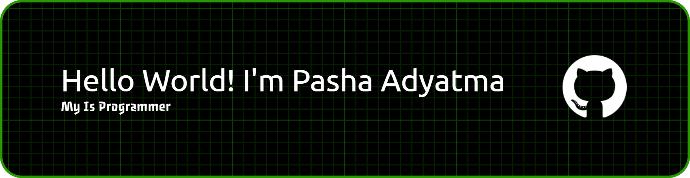

  

###

<h2 align="left">About me : </h2>

###

<h4 align="left">✨ Programmer , Tech enthusiast , Hacker , Cyber enthusiast  📚 Saya Suka Ilmu Komputer 🎲 Fun fact : Saya Seorang Cowok Terganteng Di Dunia ❤️ " Laura Fila Delfia Br Milala " 🏢 Sedang Bekerja Mencintai Laura</h4>

###

<h2 align="left">My Code : </h2>

###

  
  
  
  
  
  
  
  
  

###

<h2 align="left">My Skill : </h2>

###

  
  
  
  
  
  
  
  
  
  
  
  
  

###

  

###
